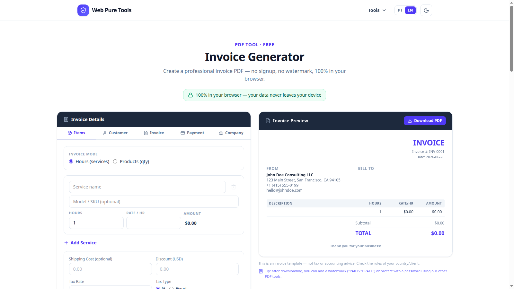

# Web Pure Tools

> **Privacy by design.** Your files and content are processed directly in your browser and are never uploaded for processing.

[Visit Web Pure Tools](https://webpuretools.com)

## English

### Practical tools without giving up your privacy

Web Pure Tools is a bilingual collection of utilities for PDFs, images, OCR, text, email and web accessibility.

The product was designed around a simple principle: **the user's information belongs to the user**. Files, passwords, pasted text, invoice details and signature data are processed locally in the browser instead of being sent to a processing server.

- No file uploads for processing
- No account or login required
- No watermark
- No tracking or advertising cookies
- Theme and language preferences stay in the user's own browser
- English and Brazilian Portuguese interface

### How the privacy model works

The tools run on the user's device after the page loads. Operations happen in browser memory, and the resulting file is downloaded directly by the user. There is no processing backend receiving or storing the document.

### Available tools

#### PDF tools

Compress, merge, split, protect, unlock, annotate and watermark PDF files directly in the browser.

#### PDF compression

Reduce image-heavy or scanned PDF files while keeping a safe fallback when the original file is already optimized.

### Featured tools

#### Invoice Generator

Create a professional invoice PDF for freelancers and international clients.

- **Hours (services) or Products (qty) mode** — switch between billing by the hour and itemized product sales
- **155 currencies** including USD, EUR, GBP, BRL, JPY and more
- **7 payment methods**: Bank Transfer (IBAN/SWIFT), ACH, PayPal, Payoneer, Wise, Crypto and Custom
- Taxes (excluded or tax-included), discounts, due dates, custom fields and an end message
- Company logo and signature uploaded and stored locally
- **Data persists without an account** — company details, logo and signature are saved in the browser via localStorage and IndexedDB, never on a server

An **invoice** is a professional billing document. It is not a Brazilian electronic tax invoice (*nota fiscal*) and does not replace country-specific tax or accounting requirements.

Financial information, client details and payment instructions are processed only in the browser.

#### Email Signature Generator

Build a professional HTML email signature with a live preview, then copy and paste it into Gmail, Outlook/Hotmail or another email service. Personal and professional information stays in the browser.

#### Accessibility Checker — explained simply

The Accessibility Checker helps identify barriers that may prevent people from using a web page, including blind, low-vision, color-blind and keyboard-only users.

The user pastes page HTML or selects an HTML file, and the analysis runs locally in an isolated browser environment. It can detect issues such as:

- Images without alternative text
- Form fields without labels
- Color contrast problems
- Incorrect heading structure
- Unclear links and ARIA issues

It follows WCAG 2.1 guidelines. Automated checks are useful, but they do not replace a complete manual accessibility audit.

### More tools

- Convert images to WebP in batches
- Extract text from images and scanned PDFs with OCR
- Compare two versions of a text

### Repository purpose

This repository is a product showcase only. It contains public product information and screenshots, but it does not contain the application's source code.

The Web Pure Tools source code is proprietary and maintained in a private repository.

---

## Português

### Ferramentas práticas sem abrir mão da privacidade

Web Pure Tools é uma coleção bilíngue de utilitários para PDF, imagens, OCR, texto, e-mail e acessibilidade web.

O produto foi criado a partir de um princípio simples: **as informações do usuário pertencem ao usuário**. Arquivos, senhas, textos colados, dados de cobrança e informações de assinatura são processados localmente no navegador, em vez de serem enviados para um servidor de processamento.

- Nenhum arquivo é enviado para processamento
- Não exige conta ou login
- Não adiciona marca-d'água
- Não usa cookies de rastreamento ou publicidade
- Preferências de tema e idioma permanecem no próprio navegador
- Interface em inglês e português do Brasil

### Como funciona o modelo de privacidade

As ferramentas rodam no dispositivo do usuário depois que a página é carregada. As operações acontecem na memória do navegador, e o resultado é baixado diretamente pelo usuário. Não existe um backend de processamento recebendo ou armazenando o documento.

### Ferramentas disponíveis

#### Ferramentas de PDF

Comprima, junte, separe, proteja, desbloqueie, anote e aplique marcas-d'água em arquivos PDF diretamente no navegador.

#### Gerador de Invoice

Crie um documento profissional de cobrança em PDF para freelancers e clientes internacionais.

- **Modo Horas (serviços) ou Produtos (qtd)** — alterne entre faturamento por hora e venda de produtos itemizados
- **155 moedas** incluindo USD, EUR, GBP, BRL, JPY e outras
- **7 métodos de pagamento**: Transferência Bancária (IBAN/SWIFT), ACH, PayPal, Payoneer, Wise, Cripto e Personalizado
- Impostos (excluído ou incluído no preço), descontos, vencimento, campos personalizados e mensagem de encerramento
- Logo e assinatura da empresa carregados e armazenados localmente
- **Dados salvos sem conta** — informações da empresa, logo e assinatura ficam no navegador via localStorage e IndexedDB, nunca em servidor

Uma **invoice** é um documento profissional de cobrança. Ela não é uma nota fiscal eletrônica brasileira e não substitui as exigências fiscais ou contábeis de cada país.

Dados financeiros, informações do cliente e instruções de pagamento são processados somente no navegador.

#### Gerador de Assinatura de E-mail

Crie uma assinatura HTML profissional com visualização em tempo real e depois copie e cole no Gmail, Outlook/Hotmail ou outro serviço de e-mail. As informações pessoais e profissionais permanecem no navegador.

#### Verificador de Acessibilidade — explicação simples

O Verificador de Acessibilidade ajuda a identificar barreiras que podem impedir o uso de uma página por pessoas cegas, com baixa visão, daltonismo ou que navegam somente pelo teclado.

O usuário cola o HTML da página ou seleciona um arquivo HTML, e a análise acontece localmente em um ambiente isolado do navegador. A ferramenta pode identificar:

- Imagens sem texto alternativo
- Campos de formulário sem rótulos
- Problemas de contraste de cores
- Estrutura incorreta de títulos
- Links pouco claros e problemas de ARIA

A análise segue as diretrizes WCAG 2.1. Verificações automáticas são úteis, mas não substituem uma auditoria manual completa de acessibilidade.

### Outras ferramentas

- Converter imagens para WebP em lote
- Extrair texto de imagens e PDFs escaneados com OCR
- Comparar duas versões de um texto

### Objetivo deste repositório

Este repositório serve apenas como apresentação do produto. Ele contém informações públicas e capturas de tela, mas não contém o código-fonte da aplicação.

O código-fonte do Web Pure Tools é proprietário e mantido em um repositório privado.
